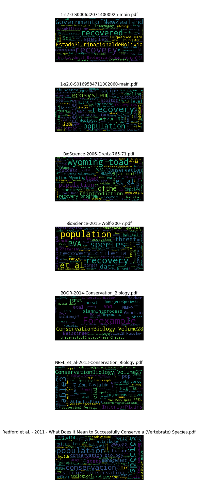
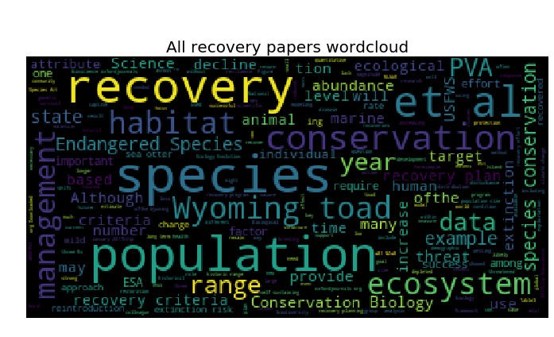

+++
title = ""
widget = "blank"  # See https://sourcethemes.com/academic/docs/page-builder/
#headless = true  # This file represents a page section.
headless = false
active = true  # Activate this widget? true/false
weight = 15  # Order that this section will appear.

[design]
  # Choose how many columns the section has. Valid values: 1 or 2.
  columns = "1"
[design.background]
  image = "grid_powerpoint_blueline.png"
  text_color_light = false
[design.spacing]
  # Customize the section spacing. Order is top, right, bottom, left.
  padding = ["20px", "0", "20px", "0"]
[advanced]
 # Custom CSS. 
 css_style = ""
+++


# Making WordClouds

***Entry format:***  *as-you-go*

## Notebook setup

Define some variables


```python
import os
outdir = os.getcwd() + '/nb_outputs/making_wordclouds'
if not os.path.isdir(outdir): os.makedirs(outdir)
```

Importage


```python
# Generic imports

import os,sys,glob,h5py,itertools,multiprocessing,\
       numpy as np,pandas as pd

# Visualization stuff

%matplotlib inline
from matplotlib import pyplot as plt
import seaborn as sns
from IPython.display import display as d

# PDF parsing and wordcloud stuff

import PyPDF2
from wordcloud import WordCloud
```

Install some libraries if needed

```bash
!pip install PyPDF2
!pip install seaborn
!pip install wordcloud
```

Go to output folder


```python
os.chdir(outdir)
```

Ok, let's get cracking...

## Test run

Test run on some papers from a friend on recovery in conversation. 


```python
pdfs_list = glob.glob('../../../files/recovery_papers_for_word_cloud/*.pdf')
def get_text(fname):
    pdf = PyPDF2.PdfFileReader(open(fname, "rb"))
    text = ' '.join([page.extractText().replace('\n', ' ') for page in pdf.pages])
    return text  
texts = {p: get_text(p) for p in pdfs_list}
all_texts = ' '.join(texts.values())
```

Here are some snippets from each paper. Some have clearly not parsed very well...


```python
for k,v in texts.items():
  print('\n\n\nPaper: %s\n\n' %k)
  print(v[:1000])
```

    
    
    
    Paper: ../../../files/recovery_papers_for_word_cloud/1-s2.0-S0006320714000925-main.pdf
    
    
    PerspectiveRe-definingrecovery:Ageneralizedframeworkforassessingspecies recoveryAlanaWestwood ,EmilieReuchlin-Hugenholtz,DavidM.Keith DepartmentofBiology,DalhousieUniversityHalifax,NovaScotiaB3H4R2,Canada articleinfo Articlehistory: Received2October2013  Receivedinrevisedform13January2014  Accepted22February2014  Availableonline22March2014 Keywords: Conservation ProtectionEndangeredspecies Recovery Speciesatrisk  PolicyabstractAtpresent,theconceptsof‘recovery’and‘recoveredstate’arepoorlydefinedandoftenconfusedwithin academicliteratureandlegislation.Thesedefinitionalinconsistenciesresultinglobaladhocattemptsat recoveryandrecoveryplansthattypicallyexhibitlowsuccessrates,andwhoseoutcomesaredifficultto  evaluate.Thereisadireneedforaninternationallyacceptedframeworktoguidethedevelopmentof plansfortherecoveryofpopulations,species,andecosystems.Suchaframeworkmustdistinguish betweentheprocessofrecoveryandtheend-stateofrecovered,andimplementquantifiable,generaliz-  ableguidelinesthatensureoptimalout
    
    
    
    Paper: ../../../files/recovery_papers_for_word_cloud/1-s2.0-S0169534711002060-main.pdf
    
    
    Recovery of marine animal populationsand ecosystemsHeike K. Lotze1, Marta Coll1,2, Anna M. Magera1, Christine Ward-Paige1andLaura Airoldi31Biology Department, Dalhousie University,  Halifax, Nova Scotia, B3H 4R2, Canada2Institut de Cie` ncies del Mar (ICM-CSIC), Passeig marõ«tim de la Barceloneta, n 37-49, 08003, Barcelona, Spain3Dipartimento di Biologia Evoluzionistica Sperimentale and CIRSA, Universita` di Bologna, Via S. Alberto 163, 48123 Ravenna, ItalyMany marine populations and ecosystems have experi-enced strong historical depletions, yet reports of recov-eries are increasing. Here, we review the growingresearch on marine recoveries to reveal how commonrecovery is, its magnitude, timescale and major drivers.Overall, 10Œ50% of depleted populations and ecosys-tems show some recovery, but rarely to former levelsof abundance. In addition, recovery can take many dec-ades for long-lived species and complex ecosystems.Major drivers of recovery include the reduction of humanimpacts, esp
    
    
    
    Paper: ../../../files/recovery_papers_for_word_cloud/BioScience-2006-Dreitz-765-71.pdf
    
    
    Forum In a perfect world,recovery programs would have  adequate funding,with public and scientific support,and would be built on a foundation ofreliable data.In reality,many  ofthese essential ingredients are missing from most recovery  programs.For example,the lack ofongoing training to help  workers remain abreast ofnew methods and ideas (Ander-  son et al.2003),the appointment ofinexperienced person-  nel to key positions (Reading and Miller 1994),and the lack  ofcoordination among agencies may particularly affect re-  covery programs.Because recovery programs are often car-  ried out with a thin margin for error,they require strong,  qualified leadership with up-to-date knowledge on species and  conservation methods. Suggested modifications to the Endangered Species Act,as well as critiques and assessments ofrecovery plans,have been  published since the early 1990s (Tear et al.1993,Hoekstra et  al.2002).The recovery program for the Wyoming toad ( Bufobaxteri ) lacks many ofthe esse
    
    
    
    Paper: ../../../files/recovery_papers_for_word_cloud/BioScience-2015-Wolf-200-7.pdf
    
    
    Forum 200   BioScience February 2015 / Vol. 65 No. 2  http://bioscience.oxfordjournals.org BioScience  65: 200Œ207. © The Author(s) 2015. Published by Oxford University Press on behalf of the American Institute of Biological Sciences. All rights  reserved. For Permissions, please e-mail: journals.permissions@oup.com.   doi:10.1093/biosci/biu218  Advance Access publication 21 January 2015 Beyond PVA: Why Recovery under  the Endangered Species Act Is   More than Population Viability SHAYE WOLF, BRETT HARTL, CARLOS CARROLL, MAILE C. NEEL, AND D. NOAH GREENWALD Recovery criteria under the Endangered Species Act are the objective, measurable targets for determining whether the recovery of listed species  has been achieved. Existing criteria have been criticized as inconsistent and poorly supported. Recent proposals for improving those criteria have   recommended framing them around population viability analysis (PVA) and setting criteria on the basis of extinction risk thresholds. Used in  
    
    
    
    Paper: ../../../files/recovery_papers_for_word_cloud/BOOR-2014-Conservation_Biology.pdf
    
    
    Review AFrameworkforDevelopingObjectiveand MeasurableRecoveryCriteriaforThreatened andEndangeredSpecies GINAK.HIMESBOOR EcologyDepartment,MontanaStateUniversity,P.O.Box173460,Bozeman,MT59717,U.S.A., emailgkhimesboor@montana.edu Abstract: ForspecieslistedundertheU.S.EndangeredSpeciesAct(ESA),theU.S.FishandWildlifeServiceand NationalMarineFisheriesServicearetaskedwithwritingrecoveryplansthatincludeÒobjective,measurable criteriaÓthatdefinewhenaspeciesisnolongeratriskofextinction,butneithertheactitselfnoragency guidelinesprovideanexplicitdefinitionofobjective,measurablecriteria.Pastreviewsofrecoveryplans, includingonepublishedin2012,showthatmanycriterialackquantitativemetricswithclearbiological rationaleandarenotmeetingthemeasureableandobjectivemandate.Ireviewedhowobjective,measureable criteriahavebeendefinedimplicitlyandexplicitlyinpeer-reviewedliterature,theESA,otherU.S.statutes, andlegaldecisions.Basedonasynthesisofthesesources,Iproposethefollowing6standardsbeusedas minimumrequirementsf
    
    
    
    Paper: ../../../files/recovery_papers_for_word_cloud/NEEL_et_al-2013-Conservation_Biology.pdf
    
    
    ContributedPaper PredictingRecoveryCriteriaforThreatenedand EndangeredPlantSpeciesontheBasisofPast AbundancesandBiologicalTraits MAILEC.NEELANDJUDYP.CHE-CASTALDO* DepartmentofPlantScienceandLandscapeArchitectureandDepartmentofEntomology,UniversityofMaryland,CollegePark,MD 20742,U.S.A. Abstract: RecoveryplansforspecieslistedundertheU.S.EndangeredSpeciesActarerequiredtospecify measurablecriteriathatcanbeusedtodeterminewhenthespeciescanbedelisted.Forthe642listed endangeredandthreatenedplantspeciesthathaverecoveryplans,weappliedrecursivepartitioningmethods totestwhetherthenumberofindividualsorpopulationsrequiredfordelistingcanbepredictedonthe basisofdistributionalandbiologicaltraits,previousabundanceatmultipletimesteps,oracombination oftraitsandpreviousabundances.Wealsotestedlistingstatus(threatenedorendangered)andtheyear therecoveryplanwaswrittenaspredictorsofrecoverycriteria.Weanalyzedseparatelyrecoverycriteria thatwerestatedasnumberofpopulationsandasnumberofindividuals(population-baseda
    
    
    
    Paper: ../../../files/recovery_papers_for_word_cloud/Redford et al. - 2011 - What Does It Mean to Successfully Conserve a (Vertebrate) Species.pdf
    
    
    Articles www.biosciencemag.orgJanuary 2011 / Vol. 61 No. 1  What Does It Mean to Successfully Conserve a (Vertebrate) Species? KENT H. REDFORD, GEORGE AMATO, JONATHAN BAILLIE, PABLO BELDOMENICO, ELIZABETHL. BENNETT, NANCY  CLUM, ROBERTCOOK, GUSTAVO FONSECA, SIMON HEDGES, FREDERICLAUNAY, SUSANLIEBERMAN, GEOR- GINAM.MACE, AKIRAMURAYAMA, ANDREA PUTNAM, JOHN G. ROBINSON, HOWARD ROSENBAUM, ERICW.   SANDERSON, SIMONN.STUART, PATRICKTHOMAS, AND JOHNTHORBJARNARSON  The conservation of species is one of the foundations of conservation biology. Successful species conservation has often been d efined as simply the  avoidance of extinction. We argue that this focus, although important,  amounts to practicing conservation at the “emergency roo m door,” and will  never be a sufficient approach to conserving species. Instead,  we elaborate a positive definition of species conservation on th e basis of six attributes  and propose a categorization of different states of species conservation using the e


Generate wordclouds


```python
wordclouds = {k:  WordCloud(max_font_size=40).generate(v) for k,v in texts.items()}
```


```python
figf = outdir + '/recovery_wordcloud_test.png'

fig, ax = plt.subplots(ncols=1,nrows=len(wordclouds), figsize=(12,20))

for wc_it,(paper_name,wc_image) in enumerate(wordclouds.items()):

  a = ax[wc_it]
    
  a.imshow(wc_image)
  a.axis('off')
  a.set_title('\n\n' + os.path.split(paper_name)[-1])

    
plt.tight_layout()

plt.savefig(figf, bbox_inches='tight')
```





Combined wordcloud from all papers:


```python
all_wordcloud = WordCloud(max_font_size=40).generate(all_texts)
```


```python
figf = outdir + '/recovery_allwordcloud_test.png'

fig, ax = plt.subplots(figsize=(12,6))

ax.imshow(all_wordcloud)
ax.axis('off')

ax.set_title('\n\nAll recovery papers wordcloud',
             fontdict={'fontsize': 20})
    
plt.tight_layout()

plt.savefig(figf, bbox_inches='tight')
#plt.close()
```




